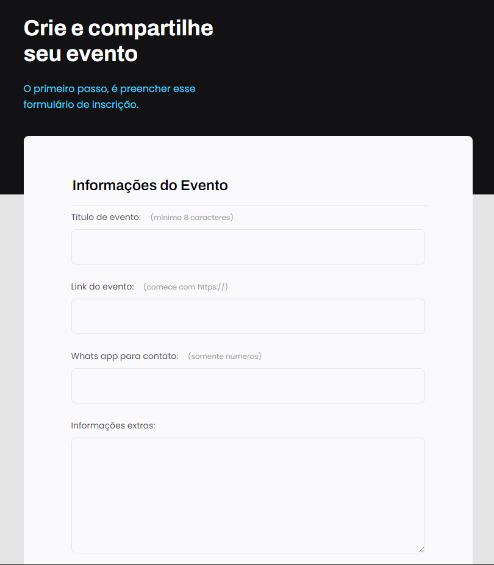
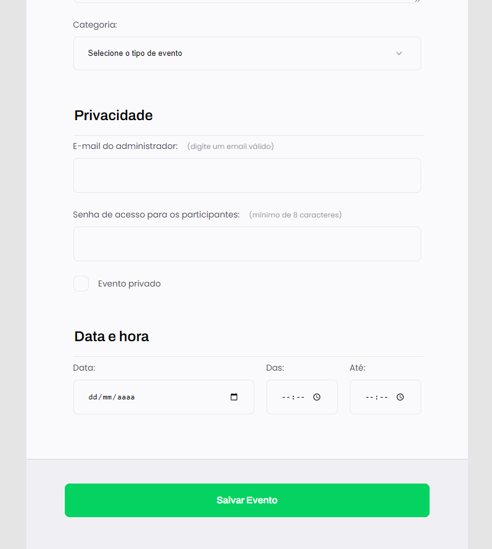

<h1 align="center"> Projeto 03.1 - Formulário de criação de eventos</h1>

Programa exclusivo e gratuito, promovido pela Rocketseat para ensino de tecnologias WEB.

  <a href="#-tecnologias">Tecnologias</a>&nbsp;&nbsp;&nbsp;|&nbsp;&nbsp;&nbsp;
  <a href="#-projeto">Projeto</a>&nbsp;&nbsp;&nbsp;|&nbsp;&nbsp;&nbsp;
  <a href="#-layout">Layout</a>&nbsp;&nbsp;&nbsp;|&nbsp;&nbsp;&nbsp;
  <a href="#memo-licença">Licença</a>

  

 

  
   

## 🚀 Tecnologias

Esse projeto foi desenvolvido com as seguintes tecnologias:

- HTML e CSS
- Git e Github
- Figma

## 💻 Projeto

O Site é um formulário onde o cliente pode fazer um pedido de criação de evento de 3 tipos:Ao vivo, Podcast e Mentoria. A interface é composta de 3 etapas:Informações do evento (Título, link, contato, categoria e extras),  Privacidade (email, senha e modo) e Data e hora do evento.

## 🔖 Layout

Você pode visualizar o layout do projeto através [DESSE LINK](<https://www.figma.com/file/Qt3vYFzUPTIiFwH2row8zB/Explorer-Stage-03-Projeto-01-(Copy)?node-id=1%3A63&mode=dev>).
É necessário ter conta no [Figma](https://figma.com) para acessá-lo.

## :memo: Licença

Esse projeto está sob a licença MIT.
Projeto desenvolvido por Leonardo Comandulli através da RocketSeat.

---
